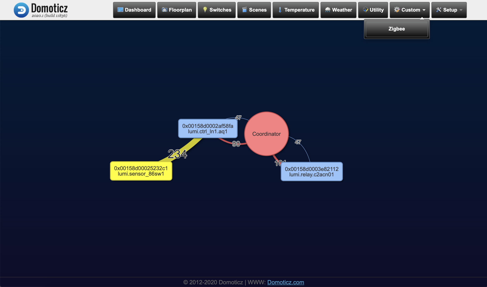

# Domoticz zigbee2mqtt network map
</img>

return {
	on = {
		customEvents = {
			'CreateZigbeeMap' -- event triggered by emitEvent
		}
	},
	data = {},
	logger = {},
	execute = function(domoticz, triggeredItem)
	    
	    function SendCommand()
            cmd = "/home/pi/domoticz/www/templates/zigbeemap/zigbeemap.sh"
            domoticz.utils.osExecute(cmd)
        end  
	    
		if (triggeredItem.isCustomEvent) then
			domoticz.utils._.print(triggeredItem.data)
			SendCommand()
		end
	end
}

